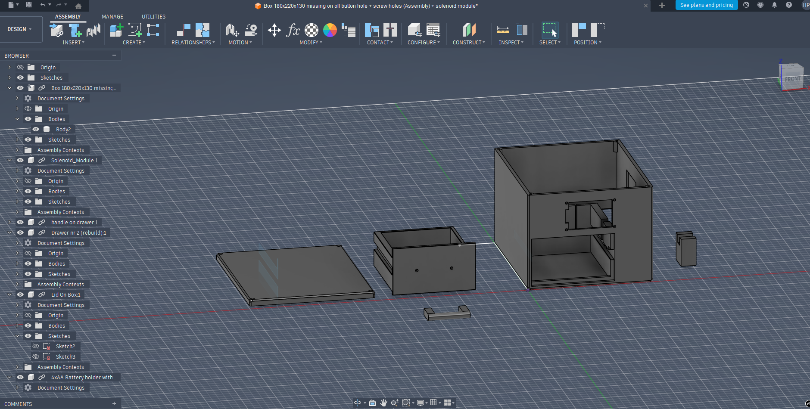
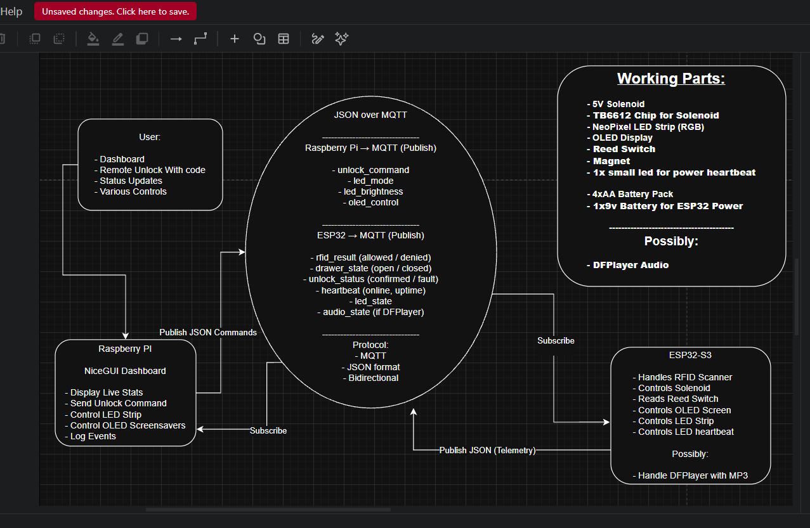

# Project 5 – 3D Printed Security Drawer Box

---

## 1. Project Overview

3D printed IoT security drawer box built around an ESP32-S3 and Raspberry Pi running NiceGUI.

### Unlock Methods
- RFID authentication  
- Remote MQTT unlock from dashboard  

The system validates real physical drawer movement using a reed switch and reports whether the unlock was confirmed or failed.

This project demonstrates:

- IoT communication using MQTT  
- JSON-based data exchange  
- Real actuator control (solenoid)  
- Physical validation using reed switch  
- Mechanical precision 3D design  

---

## 2. System Architecture

ESP32 ↔ MQTT Broker ↔ Raspberry Pi (NiceGUI)

### ESP32
- Handles RFID authentication  
- Controls solenoid via TB6612FNG  
- Reads reed switch state  
- Drives OLED display  
- Controls LED strip  
- Sends heartbeat and status data  

### Raspberry Pi
- Hosts NiceGUI dashboard  
- Sends remote unlock command  
- Displays system status  
- Logs events  

---

## 3. Flow Chart

  

The system flow chart was created in draw.io and illustrates:

- Authentication logic  
- Unlock decision flow  
- Reed confirmation  
- Fault handling  
- Reset logic  

---

## 4. Hardware

- ESP32-S3  
- TB6612FNG motor driver  
- 5V solenoid lock  
- Reed switch + magnet  
- MFRC522 RFID reader  
- 2.42" OLED (SSD1309 SPI)  
- NeoPixel LED strip (GRB)  
- 9V battery (logic power)  
- 4xAA battery pack (solenoid power)  
- Raspberry Pi  

---

## 5. MQTT & IoT Protocol

Communication protocol used:

- MQTT  
- JSON  

Broker currently used:

`broker.emqx.io`

All communication between ESP32 and Raspberry Pi is handled using structured JSON messages over MQTT.

Detailed message formats will be documented separately in the project documentation.

---

## 6. Software

### ESP32

Programmed in **MicroPython**.  
Handles hardware interaction, MQTT communication, state management, and feedback systems.

### Raspberry Pi

Runs **NiceGUI (Python)**.  
Provides dashboard interface, remote control functionality, and live monitoring.

Detailed module breakdown will be documented separately.

---

## 7. CAD & Mechanical Design

Folder: `cad/`

Contains:

- Final printable box  
- Sliding drawer  
- Solenoid mounting structure  
- Drawer holder mechanism  
- STL exports  

Designed in Autodesk Fusion.

The design focuses heavily on mechanical precision due to the solenoid having approximately 2mm of usable locking depth.

---

## 8. Known Limitations

- Battery powered demo build  
- High LED + solenoid load may cause voltage drop  
- Mechanical tolerances will be fully validated after final print  

---

## 9. Future Improvements

- DFPlayer Mini + speaker for audio feedback  
- Internal voltage regulation  
- Improved drawer alignment refinement  
- Local MQTT broker on Raspberry Pi  

---

## 10. Project Coverage

This project fulfills:

- Telemetry  
- Actuator control  
- Raspberry Pi + NiceGUI integration  
- Full IoT physical prototype design  
- 3D printed mechanical system  